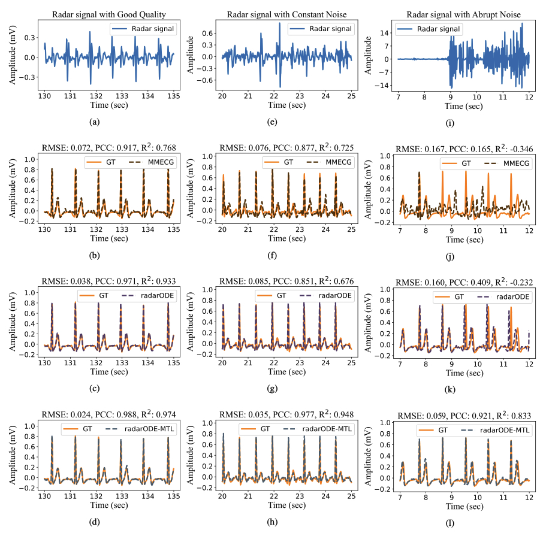

# radarODE-MTL
[](https://hits.seeyoufarm.com)

``radarODE-MTL`` is an open-source repository built on [PyTorch](https://pytorch.org/) and Multi-Task Learning (MTL) framework [LibMTL](https://github.com/median-research-group/LibMTL) and contains:

Code for Paper: 
1. [radarODE: An ODE-embedded deep learning model for contactless ECG reconstruction from millimeter-wave radar](https://arxiv.org/abs/2408.01672)
2. [radarODE-MTL: A Multi-Task Learning Framework with Eccentric Gradient Alignment for Robust Radar-Based ECG Reconstruction](https://arxiv.org/abs/2410.08656)

Presentations for:
1. radarODE
2. radarODE-MTL
3. Introduction of popular MTL optimization stratigies

:partying_face: Any problem please send them in Issues or Email [:email:](yuanyuan.zhang16@student.xjtlu.edu.cn).

## Intuitive Explanation and Introduction
Radar-based vital sign monitoring has been invested in for decades, and the community always pursue capturing more fine-grained cardiac signals with better noise robustness (especially for body movement or moving subjects). 

This repository contains two of our studies to improve the robustness of ECG recovery using the multi-task learning (MTL) paradigm and ordinary differential equation (ODE), with **radarODE** mainly improving the robust single-cycle ECG recovery and **radarODE-MTL** focusing on the long-term ECG recovery eventually.

The core idea of radarODE is to deconstruct the long-term cardiac activities into individual cardiac cycles and leverage the robustness provided by the ODE decoder to generate faithful ECG reference that aids the domain transformation in long-term ECG recovery. 

**Illustration of robustness under differnt radar qualities**



## Citation

If you find our work helpful for your research, please cite our paper:
```
@article{zhang2024radarODE,
  title={{radarODE: An ODE-embedded deep learning model for contactless ECG reconstruction from millimeter-wave radar}}, 
  author={Yuanyuan Zhang and Runwei Guan and Lingxiao Li and Rui Yang and Yutao Yue and Eng Gee Lim},
  year={2024},
  journal={arXiv preprint arXiv:2408.01672 [eess]},
  month={Aug.},
}
@article{zhang2024radarODE-MTL,
  title={radarODE-MTL: A Multi-task learning tramework with eccentric gradient alignment for robust radar-based {ECG} reconstruction}, 
  author={Yuanyuan Zhang and Rui Yang and Yutao Yue and Eng Gee Lim},
  year={2024},
  journal={arXiv preprint arXiv:2410.08656 [eess]},
  month={Oct.},
}
```

## Dataset Download and Preparation
Please refer to [MMECG Dataset](https://github.com/jinbochen0823/RCG2ECG) for the Dataset downloading.

The file structure is
```
Dataset
└───obj1_NB_1_
│   │   sst_seg_0.npy
│   │   anchor_seg_0.npy 
│   │   ecg_seg_0.npy
│   │   ...
│   ...
└───obj30_PE_91_
│   │   ...
│   │   sst_seg_215.npy
│   │   anchor_seg_215.npy 
│   │   ecg_seg_215.npy
```

The input size of the radarODE and radarODE-MTL are the spectrograms with size 50x71x120 (e.g., sst_seg_0.npy), with 71 for frequency and 120 for 3-sec segments. The ground truth ECG, anchor, cycle length can be fomulated as in the paper. You may use the example code [MMECG_to_SST
](MMECG_to_SST.m) to generate SST spectrograms, or any time-frequency representation tools are applicable.

## Run the Model
You can find the arguments and settings in:

```shell
radarODE-MTL/Projects/radarODE_plus/main.py
```
The model summary is in:

```shell
radarODE-MTL/Projects/radarODE_plus/nets/model.py
```

More details on the available MTL Architectures, Optimization Strategies and Datasets please refer to [LibMTL](https://github.com/median-research-group/LibMTL).

## Quick Introduction

The full presentation for radarODE-MTL is shown in 

```shell
radarODE/Presentations/radarODE_MTL_Presentation.pdf
```
<!-- 
### Overall Framework for radarODE


### Overall Framework for radarODE-MTL

 -->


## License

``radarODE-MTL`` is released under the [MIT](./LICENSE) license.
