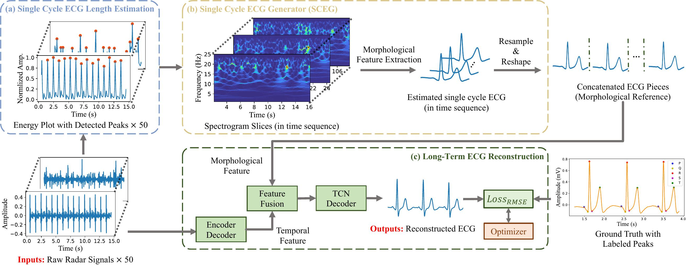
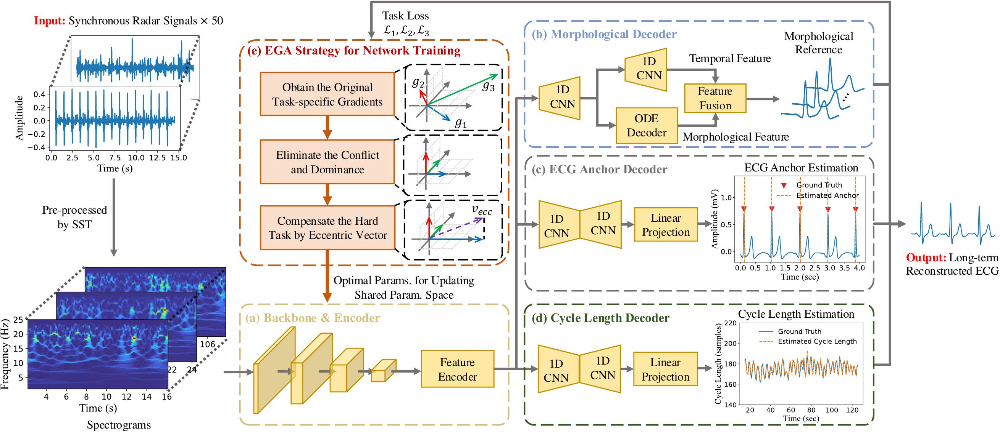
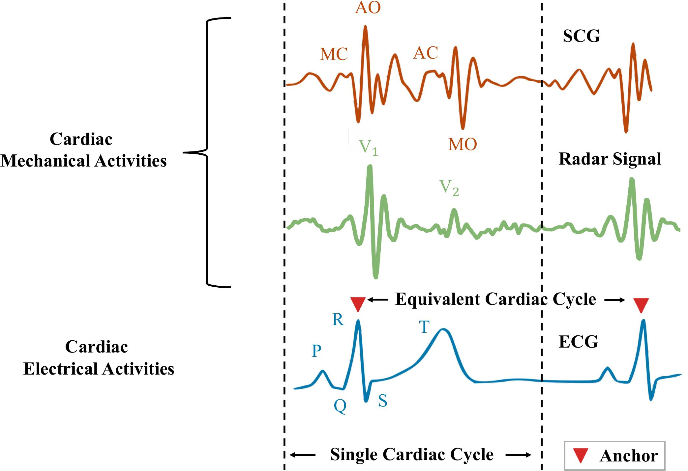
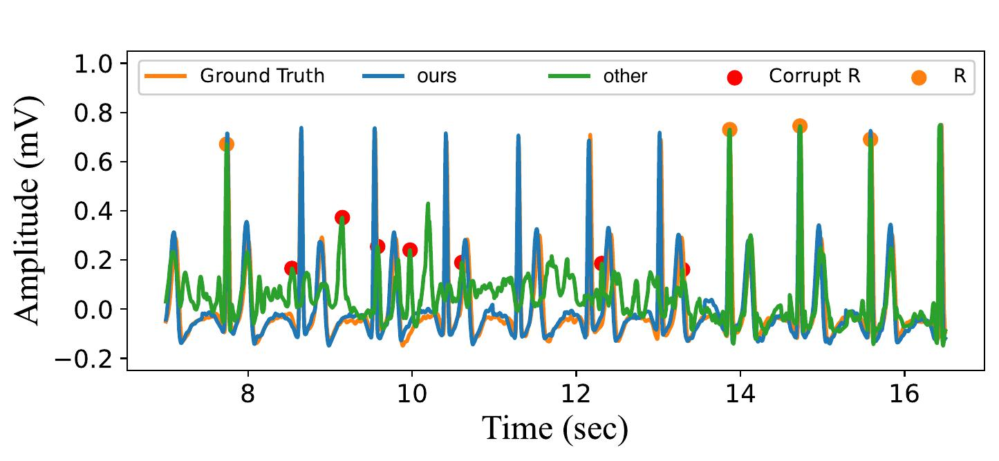

# radarODE-MTL
[](https://hits.seeyoufarm.com)

``radarODE-MTL`` is an open-source library built on [PyTorch](https://pytorch.org/) and Multi-Task Learning (MTL) framework [LibMTL](https://github.com/median-research-group/LibMTL).

Code for Paper: 

1. [radarODE: An ODE-embedded deep learning model for contactless ECG reconstruction from millimeter-wave radar](https://arxiv.org/abs/2408.01672)
2. radarODE-MTL: A Multi-Task Learning Framework with Eccentric Gradient Alignment for Robust Radar-Based ECG Reconstruction

Presentations for:

1. radarODE
2. radarODE-MTL
3. Introductions of popular MTL optimization stratigies

:partying_face: Any problem please send them in Issues or Email [:email:](yuanyuan.zhang16@student.xjtlu.edu.cn).

## Citation

If you find our work helpful for your research, please cite our paper:
```
@article{zhang2024radarODE,
  title={{radarODE: An ODE-embedded deep learning model for contactless ECG reconstruction from millimeter-wave radar}}, 
  author={Yuanyuan Zhang and Runwei Guan and Lingxiao Li and Rui Yang and Yutao Yue and Eng Gee Lim},
  year={2024},
  month={Aug.},
  journal={arXiv preprint arXiv:2408.01672 [eess]},
  month={Aug.},
}
@article{zhang2024radarODE-MTL,
  title={radarODE-MTL: A Multi-Task Learning Framework with Eccentric Gradient Alignment for Robust Radar-Based ECG Reconstruction}, 
  author={Yuanyuan Zhang and Rui Yang and Yutao Yue and Eng Gee Lim},
  year={2024},
  month={Aug.},
  journal={arXiv preprint arXiv:[eess]},
  month={Aug.},
}
```

## Dataset Download and Preparation
Please refer to [MMECG Dataset](https://github.com/jinbochen0823/RCG2ECG) for the Dataset downloading.

The file structure is
```
Dataset
└───obj1_NB_1_
│   │   sst_seg_0.npy
│   │   anchor_seg_0.npy 
│   │   ecg_seg_0.npy
│   │   ...
│   ...
└───obj30_PE_91_
│   │   ...
│   │   sst_seg_215.npy
│   │   anchor_seg_215.npy 
│   │   ecg_seg_215.npy
```

The input size of the radarODE and radarODE-MTL are the spectrograms with size 50x71x120 (e.g., sst_seg_0.npy), with 71 for frequency and 120 for 3-sec segments. The ground truth ECG, anchor, cycle length can be fomulated as in the paper.

## Run the Model
You can find the arguments and settings in:

```shell
radarODE-MTL/Projects/radarODE_plus/main.py
```
The model summary is in:

```shell
radarODE-MTL/Projects/radarODE_plus/nets/model.py
```

More details on the available MTL Architectures, Optimization Strategies and Datasets please refer to [LibMTL](https://github.com/median-research-group/LibMTL).

## Quick Introduction

The full presentation for radarODE-MTL is shown in 

```shell
radarODE/Presentations/radarODE_MTL_Presentation.pdf
```

### Overall Framework for radarODE


### Overall Framework for radarODE-MTL


### Intuition behind ECG recovery based on signle cardiac cycle


### Result from our methods in the presence body movement


## License

``radarODE-MTL`` is released under the [MIT](./LICENSE) license.